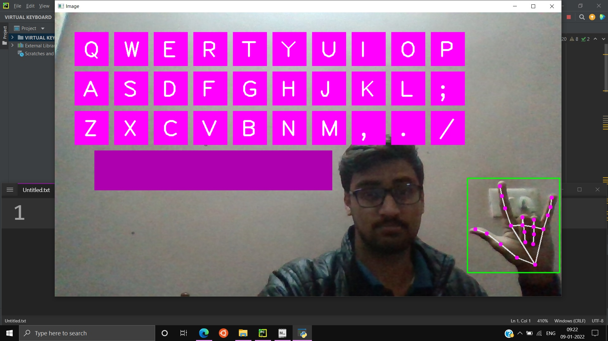

# Virtual-Keyboard
___

## 1.0 About Project : 

- It provides real time typing.
- The keyboard’s keys can be viewed in the screen.
- Know Iron-Man? We can literally type in the air.
- Application : If you do not want to get your keyboard dirty, use this :D
- Maybe in future, we use this instead of a keyboard. That would be quite amazing.
- You see, required components would be a Screen, a Camera and a CPU 🙊

## 2.0 Requirements for the Project:

- ### 2.1 Hardware Requirements: 
    - Tried unsuccessfully in Raspberry-Pi
    - Even though, we would need a CPU, a Camera and a Screen
- ### 2.2 Software Requirements:
    - Visual Studio Code (or any Editor)
    - Hand-Tracking library
    - CV Zone

## 3.0 Snapshot of Project

**_Software UI looks like this_**

___
